# 📝 Resumate - AI Resume Builder

Resumate is an intelligent and sleek AI-powered Resume Builder that enables users to craft multiple, job-specific resumes with rich customization and effortless AI assistance — all in one seamless interface.

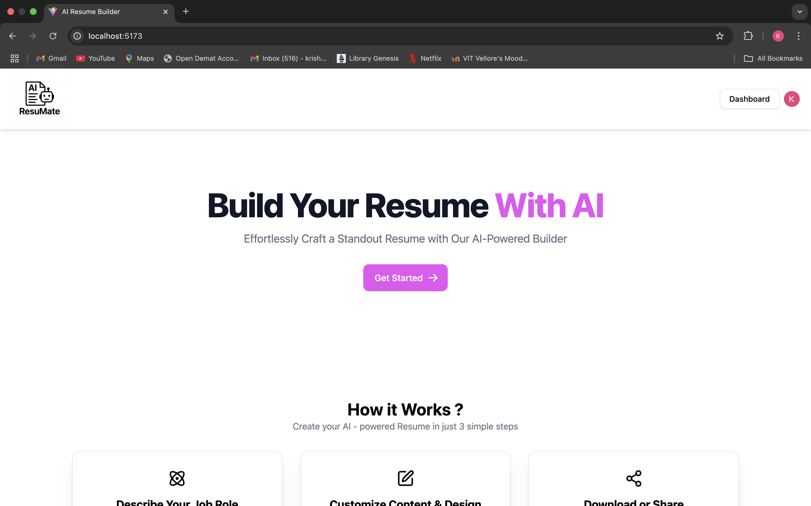 <!-- You can replace this with your banner image -->
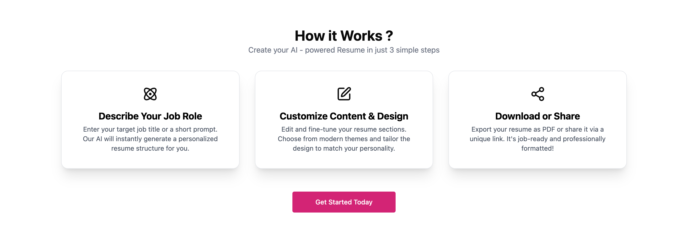

---

## 🚀 Features

- 🔐 **Clerk Authentication**
  - Secure Sign-up/Sign-in using [Clerk](https://clerk.dev/) for a personalized user experience.

- 📄 **Create, Edit, Save, Delete & Download Resumes**
  - Manage multiple resumes tailored to different job profiles.
  - CRUD operations backed by [Strapi CMS](https://strapi.io/).

- 🧠 **AI-Generated Content**
  - Use the **Gemini AI API** to auto-generate:
    - `Profile Summary`
    - `Work Experience`

- 🎨 **Theme Customization**
  - Select custom **theme border colors** for your resume for a personalized aesthetic.

- ✍️ **Rich Text Formatting**
  - Use a powerful **RichTextEditor** to:
    - Format `Work Experience` section with bullet points (disc, numeric, alphabetic).
    - Apply **Bold**, *Italic*, or <u>Underline</u> styles to your content.

- ☁️ **Strapi CMS Integration**
  - All resume data is saved on a **headless CMS backend** for persistent and scalable storage.

---

## 🧰 Tech Stack

| Technology     | Description                          |
|----------------|--------------------------------------|
| [React](https://reactjs.org/)       | UI Library used with Vite setup     |
| [Vite](https://vitejs.dev/)         | Lightning-fast frontend bundler     |
| [Tailwind CSS](https://tailwindcss.com/) | Utility-first CSS framework         |
| [ShadCN UI](https://ui.shadcn.dev/) | Beautiful, accessible UI components |
| [Strapi CMS](https://strapi.io/)    | Headless CMS Backend                |
| [Clerk](https://clerk.dev/)         | User Authentication & Management    |
| [Gemini AI API](https://ai.google.dev/) | AI Content Generation               |

---

## 📸 Screenshots

> Insert screenshots below by replacing the image links with your actual paths.

| Login Page | Dashboard | Editor |
|------------|-----------|--------|
| 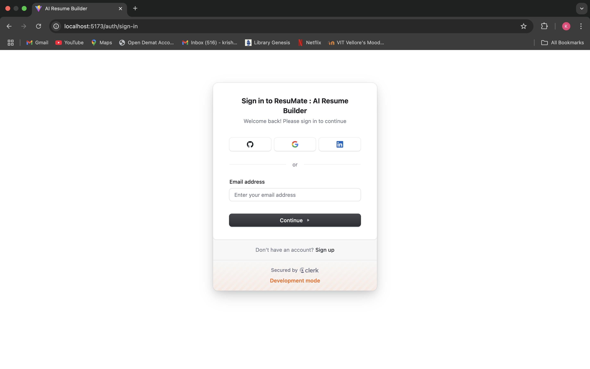 |  | 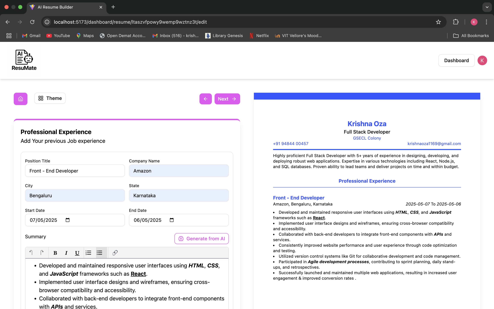 |

---

## 🔧 Installation & Setup

### 1. Clone the Repository

```bash
git clone https://github.com/your-username/resumate-ai-resume-builder.git
cd resumate-ai-resume-builder
```

### 2. Install Dependencies

```bash
npm install
```


### 3. Set Up Environment Variables
Create a .env file in the root of your project with the following keys:

    VITE_CLERK_PUBLISHABLE_KEY=your_clerk_publishable_key
    VITE_STRAPI_URL=http://localhost:1337
    VITE_GEMINI_API_KEY=your_gemini_api_key


Make sure your Strapi backend and Clerk dashboard are configured accordingly.


### 4. Run the Development Server
    npm run dev
The app should now be running at http://localhost:5173
<br><br>

## 🧪 Folder Structure

    ├── public/
    ├── src/
    │   ├── components/
    │   ├── pages/
    │   ├── hooks/
    │   ├── utils/
    │   └── App.jsx
    ├── .env
    ├── index.html
    ├── tailwind.config.js
    └── vite.config.js
<br><br>

## 📂 Backend Setup (Strapi CMS)


(1) Install and run Strapi:
```bash
    npx create-strapi-app backend --quickstart
```
    
(2) Define the necessary content types (Resume, User, etc.)
<br>
(3) Enable CORS and set appropriate API permissions.
<br>
(4) Connect your frontend app to the Strapi backend using the base URL in .env.

<br><br>

## 🤖 AI Integration (Gemini API)

(1) You can find the Gemini API key by visiting Google AI Studio. <br>
(2) Make sure you handle all prompts and AI interactions securely on the frontend.

<br><br>

## ✅ To-Do & Future Enhancements

 (1) Add PDF Preview Modal
  <br>
 (2) Implement Version Control for Resume Changes
  <br>
 (3) Integrate LinkedIn or Resume Parsing
  <br>
 (4) Drag-and-drop resume section ordering
  <br>
 (5) Auto-save on field change
  <br>


## ✅ Screenshots of DEMO


<br>

<br>
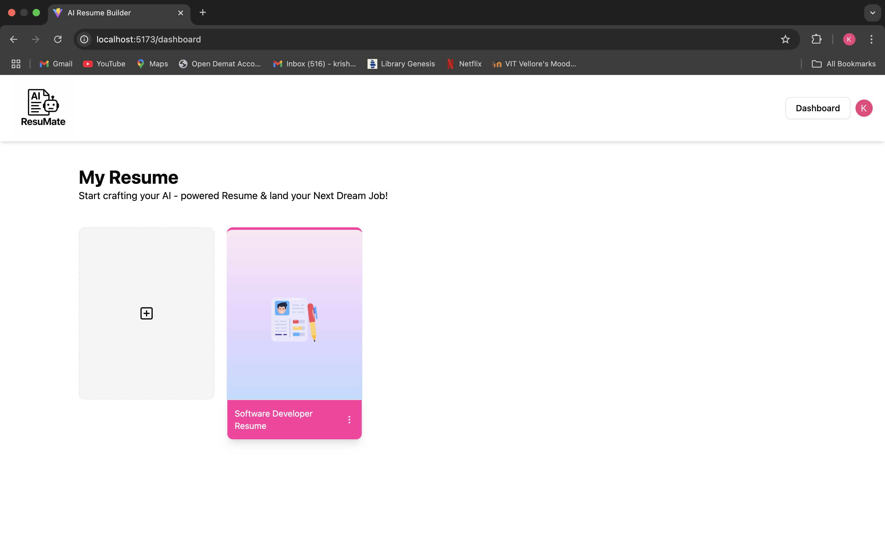
<br>
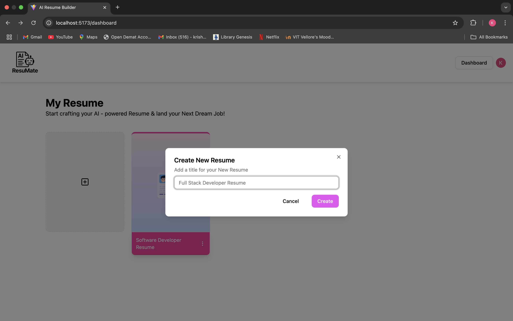
<br>
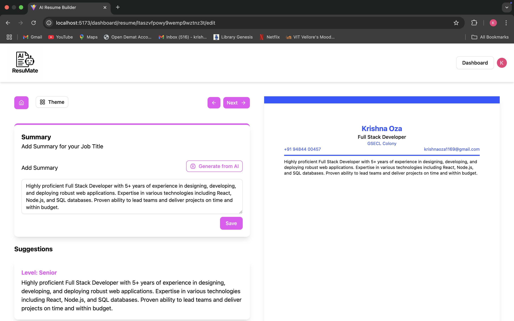
<br>
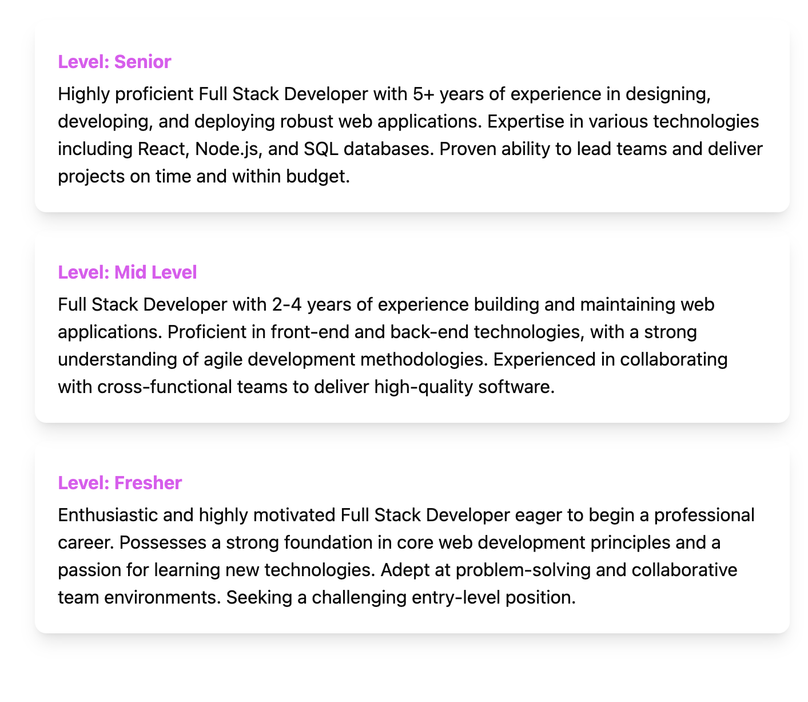
<br>

<br>
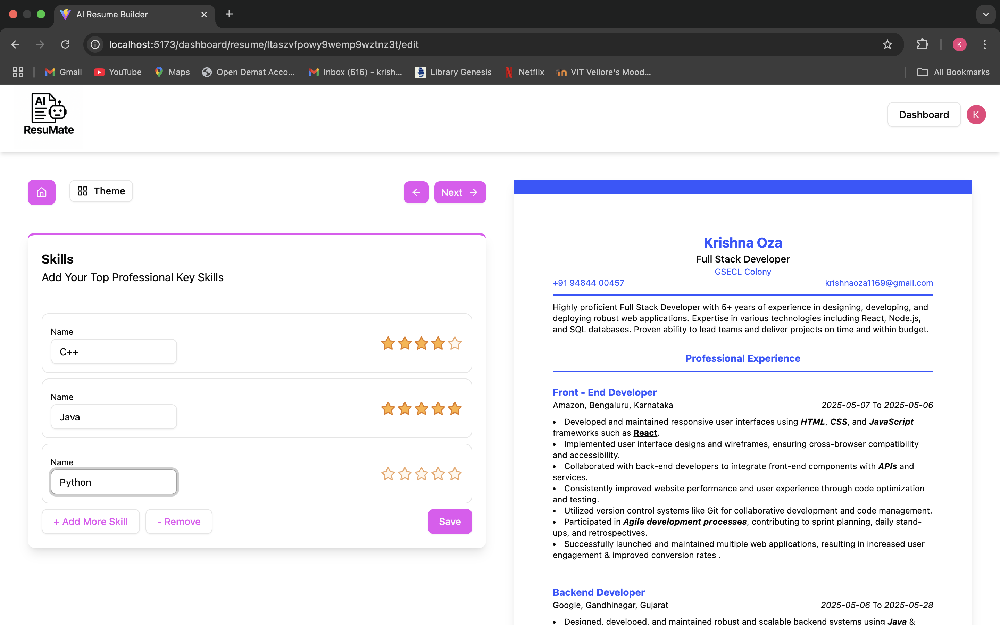
<br>
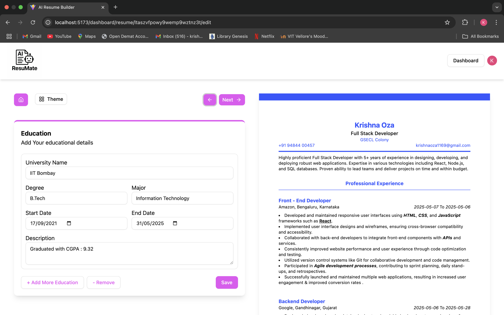
<br>
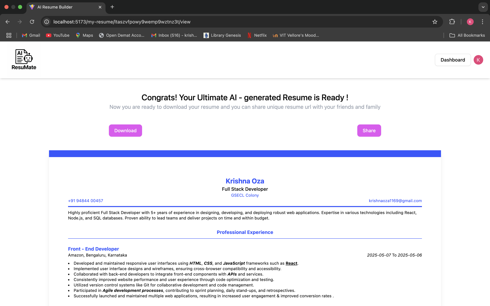
<br>
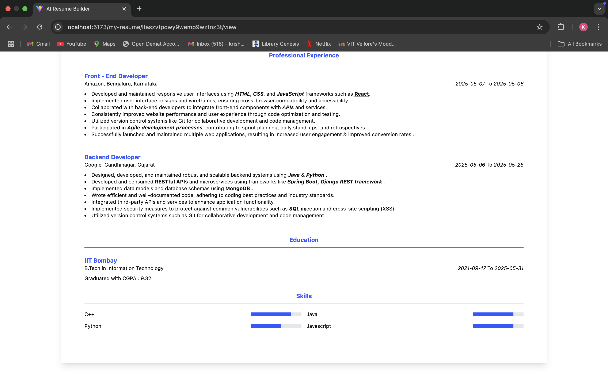
<br>
